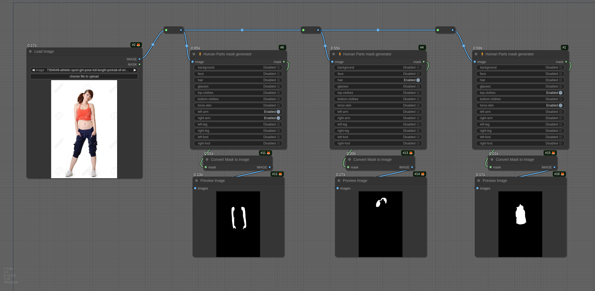

# Human Parts Urutora

Detect human parts using the DeepLabV3+ ResNet50 model from Keras-io. You can extract hair, arms, legs, and other parts
with ease and with small memory usage.

This node aims to detect human parts using the model created by
[Keras-io](https://huggingface.co/keras-io/deeplabv3p-resnet50). Their "[Space](https://huggingface.co/spaces/keras-io/Human-Part-Segmentation)" was impressive, and I wanted to use the
model.

Unfortunately, the model uses an old Keras version, and there were no PyTorch implementation.

So I decided to convert the model to [ONNX](https://onnx.ai/) format and to create my [HugginFace
repository](https://huggingface.co/Metal3d/deeplabv3p-resnet50-human) to share the model with the community.

> Fortunately, Keras provides the model with a CC1.0 license, thank you guys to allow us to use it without any
> restriction.

## Example

You can drag and drop the following image to try:



## DeepLabV3+ ResNet50 for Human

Actually, all the model I found was not trained to detect human parts, but to detect some objects or urban elements. The
Keras model is the only one I found that works!

## Installation

I strongly recommend to use ComfyUI-Manager to install the node. It will install the dependencies and the model.

> Note, as far as my repository isn't validated in the ComfyUI-Manager index, you must do the installation manually.
>
> If you set up ComfyUI-Manager to "middle" or "weak" security, you can use the "Install from Git URL" feature.

```bash
# ensure that you have activated the virtual environment before !!

# then...
cd /path/to/your/ComfyUI/custom_nodes
git clone https://github.com/demib72/ComfyUI_Human_Parts_Urutora.git
cd ComfyUI_Human_Parts_Urutora
pip install -r requirements.txt
# or
python -m pip install -r requirements.txt

# install the model
python install.py
```

On RunPod, run the commands with the Python executable that launches ComfyUI.
For the common `/workspace/ComfyUI` layout:

```bash
cd /workspace/ComfyUI/custom_nodes
cd ComfyUI_Human_Parts_Urutora
/workspace/ComfyUI/venv/bin/python -m pip install -r requirements.txt
/workspace/ComfyUI/venv/bin/python install.py
```

Some RunPod templates use `/workspace/ComfyUI/.venv/bin/python` or the system
`python` instead. Check the ComfyUI startup command and use that exact
interpreter. The package supports both the current V3 extension API and the
legacy `NODE_CLASS_MAPPINGS` loader used by older RunPod ComfyUI templates.

Remove any second copy of this node from `custom_nodes`; duplicate copies can
register the same node identifiers unpredictably. After restarting ComfyUI,
the startup log should not contain `IMPORT FAILED` for `Human_Parts_Urutora`.

Use the same Python environment that starts your local ComfyUI installation
for dependency installation, model installation, and tests. For example, from
this repository when ComfyUI is installed beside it:

```bash
../ComfyUI/venv/bin/python -m pip install -r requirements.txt
../ComfyUI/venv/bin/python install.py
../ComfyUI/venv/bin/python -m unittest discover -s tests -v
```

Then, restart ComfyUI and refresh the UI. The nodes are registered under the
"Human Parts Urutora" category.

The node identifiers use a separate Urutora namespace, so this package can be
installed alongside earlier variants without registration conflicts. Update
node types in existing workflows to one of the following identifiers:

- `HumanPartsUrutoraMaskGenerator`
- `HumanPartsUrutora`
- `LayerMask: HumanPartsUrutora`

No aliases are registered under the old identifiers.

The `HumanPartsUrutoraMaskGenerator` node supports image batches and returns
standard ComfyUI `[B,H,W]` float32 masks.
Its ONNX session is shared with Human Parts Urutora and reused between executions.
Workflows may prefer Human Parts Urutora for its additional refinement and
RGBA output options.


## Human Parts Urutora

This fork also includes a standalone port of LayerStyle Advance's
`LayerMask: HumanPartsUrutora` node without requiring the complete LayerStyle
Advance node suite.

Human Parts Urutora was originally implemented by
[chflame163](https://github.com/chflame163) as part of
[ComfyUI LayerStyle Advance](https://github.com/chflame163/ComfyUI_LayerStyle_Advance),
building on Metal3d's original Human Parts Urutora node. The port is used under the
MIT License with its copyright and permission notice preserved in
[THIRD_PARTY_NOTICES](./THIRD_PARTY_NOTICES).

In addition to the ONNX human-parts segmentation, Human Parts Urutora provides:

- Batch processing.
- An RGBA image output whose alpha channel contains the selected mask.
- A standard ComfyUI `MASK` output.
- Optional VITMatte, PyMatting, or Torch-native Guided Filter edge refinement
  without OpenCV contrib/ximgproc.
- CPU or CUDA selection for VITMatte.
- Optional `face skin (preserve features)` and `eyes` masks use a lightweight
  ResNet-18 BiSeNet face parser, guided by CCIHP face regions so small faces are
  parsed at higher resolution. Face skin leaves eyebrows, eyes, nose, mouth,
  lips, and ears unmasked while retaining the surrounding eye-socket skin.
  Avoid enabling the coarse `face` option at the same time, since it includes
  the features that the face-skin option is designed to preserve.

VITMatte models are downloaded from Hugging Face into
`ComfyUI/models/vitmatte` on first use. Select `VITMatte(local)` to prohibit a
model download and use files already present in that directory. The original
ONNX segmentation models are installed with `python install.py`. Existing
installations should run it again to download the face parser; if it is absent,
the node logs a warning and uses the legacy geometric eye estimate.

The port fixes the original upstream node's left-foot selection bug. ONNX uses
the `onnxruntime-gpu` package with an explicit `auto` provider policy: it tries
advertised CUDA and CPU providers in that order, and retries with CPU if CUDA
cannot initialize. TensorRT is neither installed nor selected. Both Human Parts
Urutora nodes share this behavior.

To choose a starting provider explicitly, set
`COMFYUI_HUMAN_PARTS_URUTORA_ONNX_PROVIDER` to `cuda` or `cpu` before
starting ComfyUI. The default is `auto`; explicit accelerated policies still
retain lower-priority providers as execution fallbacks. If an explicitly
selected provider is not installed, the node reports the available providers
and how to return to `auto`.
See [THIRD_PARTY_NOTICES](./THIRD_PARTY_NOTICES) for attribution and licensing.
